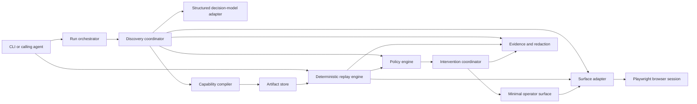
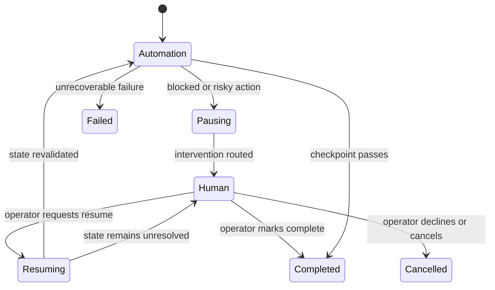

# Computer-Use Automation System Design Specification

**Status:** Implemented and verified
**Date:** 2026-09-10
**Primary objective:** Build a generic computer-use LLM system that discovers workflows on arbitrary UI platforms, compiles successful runs into reusable typed capabilities, and replays those capabilities deterministically for agent invocation.

## 1. Purpose

The system gives an AI agent a safe way to operate applications that do not expose a usable API. An LLM discovers a UI workflow once. The system converts the successful run into a typed, versioned capability artifact. Future invocations replay that artifact deterministically without an LLM making decisions.

The system is platform- and domain-independent. A caller supplies the goal, target, inputs, and policy at runtime. The core contracts contain no assumptions about banking, shopping, media, maps, or any other application category. Concrete websites and applications are validation surfaces, not product boundaries.

## 2. Authoritative requirements

This design defines the product requirements, delivery contract, scope boundaries, and quality expectations. The implementation plan traces every must-have capability to executable verification and evidence.

## 3. Goals

1. Run a genuine LLM-driven observe, decide, and act loop against a live UI.
2. Bound discovery by maximum steps, elapsed time, repeated-state detection, and explicit policy.
3. Compile a successful run into a reviewable capability with typed inputs, typed outputs, robust targets, and checkpoints.
4. Replay a capability without an LLM in the decision path.
5. Distinguish success, known business outcomes, recoverable conditions, intervention, and hard failure.
6. Enforce configurable navigation and action allowlists.
7. Pause and transfer the same live session to a human when blocked or when an operation is risky.
8. Resume safely after human action and preserve evidence across the handoff.
9. Redact secrets and sensitive values before evidence is persisted.
10. Let a new user clone the repository, configure their own Gemini access, run discovery, generate a capability, and replay it.
11. Generate capabilities for unrelated tasks and platforms without changing core discovery, artifact, replay, policy, or handoff code.

## 4. Non-goals for the first complete slice

- Production queues, clusters, or distributed workers.
- Real credentials, personal data, or sensitive production systems.
- Production authentication and authorization infrastructure.
- Full remote co-browsing.
- Automated desktop support in the first milestone.
- Multi-tenant runtime infrastructure.
- Open-ended LLM recovery during deterministic replay.
- Automatic artifact approval or confidence scoring.
- Large capability catalogs.
- Broad browser matrices.

## 5. General task model and validation strategy

### 5.1 Runtime task contract

Every discovery run accepts:

- A natural-language goal.
- A target application, URL, or entry point.
- Invocation inputs that may become capability parameters.
- A policy defining permitted navigation, actions, and risk handling.
- Optional expected outputs and completion hints.
- Stopping limits for steps, duration, retries, and repeated states.

The LLM discovers the workflow from the live surface. The capability compiler separates reusable structure from invocation-specific values, producing an agent-invocable artifact rather than a domain-specific script.

### 5.2 Illustrative task families

The system is not limited to these examples. They provide coverage dimensions for validating the generic architecture:

- **Search and extraction:** find a product, place, document, video, record, or setting and return typed information.
- **Navigation and review:** navigate a multi-step flow and stop at a verifiable review state.
- **Reversible interaction:** apply filters, add an item to a cart, change a temporary setting, or fill a form without final commitment.
- **Media control:** find and start permitted media, then verify playback state.
- **Risk-gated action:** reach a purchase, submission, deletion, account change, or other consequential final action and transfer control to a human before execution.
- **Known alternative outcome:** detect no results, unavailable content, invalid input, denied permission, or another legitimate business outcome.

### 5.3 Mandatory validation slice

The first complete slice uses one automation-friendly live web surface and one non-destructive task that exercises goal interpretation, UI discovery, parameterization, typed extraction, checkpoint verification, artifact generation, and model-free replay. The same engine then demonstrates an exceptional state and a risk-gated handoff. Additional sites and task families validate generality only after this slice passes.

Automated tests use controlled local fixtures so correctness does not depend on a third-party site. Live demonstrations use only targets that permit automation and do not require real credentials or personal data.

## 6. Architecture



### 6.1 Component boundaries

| Component | Responsibility | Must not do |
|---|---|---|
| CLI | Parse commands, configuration, and display structured results | Contain discovery or replay logic |
| Run orchestrator | Create run context and coordinate lifecycle | Execute framework-specific UI operations |
| Discovery coordinator | Observe, call model, validate decisions, act, detect completion | Persist raw unredacted observations |
| Model adapter | Convert normalized observations into structured proposed actions | Directly control the UI |
| Surface adapter | Observe and act on a concrete UI session | Decide business intent |
| Capability compiler | Convert a successful trace into a parameterized artifact | Preserve raw model reasoning as the artifact |
| Replay engine | Execute validated artifact steps without model decisions | Improvise an unrecorded action |
| Policy engine | Enforce target, route, action, and risk rules | Trust model output without validation |
| Intervention coordinator | Pause, route context, track control ownership, resume | Create a replacement UI session |
| Evidence service | Redact and persist logs, snapshots, screenshots, and traces | Persist configured sensitive fields |
| Artifact store | Load and save versioned artifacts atomically | Accept invalid or unknown schemas |

### 6.2 Surface abstraction

The first adapter uses Playwright .NET. The boundary supports future legacy-web and desktop adapters.

```csharp
public interface IComputerSurface
{
    Task<SurfaceObservation> ObserveAsync(CancellationToken cancellationToken);
    Task<ActionResult> ExecuteAsync(SurfaceAction action, CancellationToken cancellationToken);
    Task<EvidenceReference> CaptureEvidenceAsync(EvidenceKind kind, CancellationToken cancellationToken);
    Task PauseAutomationAsync(CancellationToken cancellationToken);
    Task ResumeAutomationAsync(CancellationToken cancellationToken);
}
```

The capability contains semantic actions and target descriptors. Framework-specific adapter details are isolated in target strategies and bindings.

## 7. Discovery design

### 7.1 Inputs

- Natural-language goal.
- Target definition containing entry point and application profile.
- Policy profile.
- Maximum steps.
- Maximum duration.
- Repeated-state threshold.
- Optional capability name and description.

### 7.2 Loop

1. Validate target and policy before opening the session.
2. Observe a bounded, redacted representation of the current state.
3. Compute a stable observation fingerprint.
4. Stop or escalate when time, step, or repeated-state limits are reached.
5. Ask the model for one structured action and an externally safe explanation.
6. Validate the response against the action schema.
7. Resolve possible parameters and target descriptors.
8. Evaluate policy immediately before execution.
9. Execute one action.
10. Record the normalized action, result, observation references, and timing.
11. Verify completion through an explicit checkpoint rather than model assertion alone.
12. Compile an artifact only after verified success.

### 7.3 Model response contract

The model returns a constrained discriminated union such as:

- navigate
- click
- type
- select
- read
- wait
- complete
- request-intervention

The model cannot submit arbitrary code, shell commands, selectors with script evaluation, or unrestricted URLs.

### 7.4 Authenticity evidence

The evidence package records:

- Model and provider metadata without credentials.
- Redacted observation summaries.
- Proposed actions.
- Validation and policy decisions.
- Actual action results.
- Step timing.
- Final verified checkpoint.

This demonstrates that discovery was genuine rather than a pre-authored replay.

## 8. Capability artifact

### 8.1 Top-level contract

| Field | Purpose |
|---|---|
| schemaVersion | Selects the artifact reader and migration path |
| capabilityId | Stable identifier |
| name and description | Human- and agent-readable contract |
| target | Product family, surface type, and compatible variants |
| risk | Overall capability risk and approval policy |
| inputs | Typed invocation parameters and validation constraints |
| outputs | Typed returned values and extraction definitions |
| steps | Ordered deterministic operations |
| outcomes | Known business outcomes and detection rules |
| checkpoint | Final success assertion |
| provenance | Discovery run reference, creation time, and tool version |
| tenantBindings | Optional values and overrides outside the base flow |

### 8.2 Inputs and outputs

Supported initial primitive types are string, integer, decimal, boolean, date, and enum. Constraints include required, format, minimum, maximum, pattern, and permitted values.

Sensitive input values are substituted at runtime and never serialized into the artifact. Output definitions include type, extraction source, masking policy, and required status.

### 8.3 Steps

Each step includes:

- Stable step identifier.
- Action type.
- Parameterized arguments.
- Target descriptor when applicable.
- Preconditions.
- Wait strategy and timeout.
- Expected postcondition.
- Known conditions and responses.
- Retry policy limited to explicitly recoverable conditions.
- Risk classification.
- Evidence policy.

### 8.4 Target descriptor

A target can carry multiple ordered strategies:

1. Accessibility role and accessible name.
2. Associated label and control type.
3. Stable application identifier when available.
4. Constrained text match.
5. Structural relation to a stable landmark.
6. CSS or XPath fallback scoped to a stable container.
7. Screenshot region or coordinate only for adapters that support it and only with an anchoring strategy.

Replay records which strategy matched. Ambiguous matches fail rather than selecting the first match silently.

### 8.5 Versioning

- Initial artifacts use schema version 1.
- Readers reject unsupported major versions.
- Additive optional fields do not change the major version.
- Breaking field or behavior changes require a new major version and an explicit migrator.
- Artifacts remain immutable after approval; updates produce a new revision.

## 9. Deterministic replay

Replay performs no model calls and has no model fallback in the required path.

1. Validate artifact and input bindings.
2. Resolve target profile and policy.
3. Open or attach to one session.
4. Execute steps in artifact order.
5. Apply recorded waits, target strategies, and preconditions.
6. Detect known outcomes before and after each relevant action.
7. Retry only conditions explicitly marked recoverable.
8. Escalate or fail on unknown state.
9. Verify the final checkpoint independently.
10. Extract, validate, and redact declared outputs.
11. Return a structured result with evidence references.

### 9.1 Result contract

| Status | Meaning |
|---|---|
| success | Checkpoint passed and outputs validated |
| business-outcome | A declared legitimate negative or alternative result was detected |
| intervention-required | Automation paused and a human decision or action is required |
| cancelled | A human or caller ended the run safely |
| failure | An unrecoverable technical, policy, schema, or application problem occurred |

Every non-success result includes run ID, capability ID, step ID, category, safe message, expected state, observed-state summary, and evidence references. Internal exceptions do not become the public result contract.

## 10. Error handling

| Class | Examples | Response |
|---|---|---|
| Business outcome | No search results, unavailable item, invalid request for the target | Return declared outcome; do not retry |
| Recoverable | Known dialog, transient load, bounded slow response | Apply explicit recovery and bounded retry |
| Intervention | Risky submit, unknown confirmation, permission decision | Pause same session and route request |
| Hard failure | Ambiguous target, unsupported artifact, checkpoint failure | Stop and return debuggable failure |

Unknown states never trigger open-ended model recovery during replay.

## 11. Safety and policy

The policy is configuration, not prompt text. It defines:

- Allowed schemes, hosts, ports, and route patterns.
- Allowed action types.
- Optional action limits per run.
- Input and output sensitivity classifications.
- Risk classification rules.
- Actions requiring intervention.
- Screenshot and snapshot retention rules.

Policy is evaluated at startup and immediately before every action. Redirects and pop-ups are revalidated. Navigation outside the allowlist is blocked.

The initial risk levels are safe, reversible-write, and irreversible. Irreversible actions require intervention. The demonstration uses a consequential final submission to prove that policy stops automation before commitment.

## 12. Human handoff

### 12.1 Control states



### 12.2 Intervention request

The request carries:

- Run, goal, capability, and target identifiers.
- Current step and action proposal.
- Reason and risk classification.
- Redacted state summary.
- Screenshot or snapshot reference.
- Allowed operator responses.
- Current control owner and lease/version.

### 12.3 Same-session guarantee

The browser context and page remain alive while automation is paused. The operator surface connects to that run rather than launching a new session. Only the current control owner may issue actions. Resume increments the control version and requires a fresh observation and precondition check.

Human actions are recorded as a separate evidence category. Sensitive text is redacted before persistence.

## 13. Evidence and redaction

### 13.1 Evidence package

- Discovery event log.
- Replay event log.
- Generated capability.
- Failure screenshot or snapshot.
- Intervention request and control transitions.
- Human action summary.
- Final structured result.

### 13.2 Redaction

Redaction happens before data reaches persistent sinks. Rules cover:

- Environment variable values and credentials.
- Authorization headers, cookies, and tokens.
- Configured sensitive input fields.
- Personal or account identifiers where unnecessary.
- Email addresses and phone numbers.
- Free-form text matching sensitive patterns.

The system favors allowlisted evidence fields over attempting to remove secrets from arbitrary serialized objects.

## 14. Target strategy

The engine accepts a target at runtime. The initial live demonstration uses an externally reachable, automation-permitted web surface with a repeatable, non-destructive workflow. A project-controlled test surface is preferred because it can expose deterministic success, alternative-outcome, recovery, and risk-gated states without real credentials or personal data.

The target source may be included in the repository, but starting it locally is not required for the primary evaluator path. Core tests use controlled local fixtures and fake adapters so external availability does not determine test results. Adding a new target must require configuration or a surface binding, not changes to core orchestration.

A future WPF target and FlaUI adapter can validate the desktop seam on Windows. They are not prerequisites for the core-complete milestone.

## 15. Heterogeneity and multi-tenant design

### 15.1 Legacy web and desktop

Capabilities express semantic actions, targets, waits, outcomes, and checkpoints. Surface adapters translate them into Playwright, accessibility API, screenshot-coordinate, or OS automation operations.

Adapter-specific target strategies live in optional bindings. The base capability does not require a clean DOM or test IDs.

### 15.2 Multi-tenant reuse

A capability targets a product family and compatible version range. Tenant configuration supplies:

- Entry point and permitted routes.
- Branding and locale aliases.
- Tenant-specific target-strategy overrides.
- Feature flags and workflow variants.
- Policy restrictions.

Resolution order is base capability, product-version binding, then tenant override. Overrides cannot weaken centrally required safety policy.

A preflight probe evaluates expected landmarks and application version before unattended replay. Incompatible probes quarantine the capability for that tenant and request review rather than silently modifying it.

## 16. Security, privacy, and responsible use

- No real credentials or real PII are used in examples or evidence.
- Secrets come from environment variables or user-local secret storage.
- Configuration templates contain placeholders only.
- Model observations are minimized and redacted.
- Model output is untrusted input and schema validated.
- Navigation and actions are policy checked.
- Artifact paths and names are sanitized.
- Evidence writes are confined to an approved root.
- Browser script evaluation is unavailable to the model action contract.
- External targets must permit automation and receive low-volume traffic.

## 17. Testing strategy

### 17.1 Unit tests

- Artifact schema acceptance and rejection.
- Input and output validation.
- Parameter binding.
- Target-strategy ordering and ambiguity.
- Result taxonomy.
- Policy decisions.
- Redaction before persistence.
- Stopping-condition and repeated-state logic.
- Handoff state transitions and control ownership.

### 17.2 Integration tests

- Recorded capability replay against a deterministic fixture.
- Known business-outcome detection.
- Bounded transient recovery.
- Hard failure with evidence.
- Risky action creates intervention before execution.
- Human resume revalidates the state.
- Replay test fails if the model adapter is invoked.

### 17.3 End-to-end tests

- Genuine discovery creates a valid artifact.
- Generated artifact replays with different parameters.
- Outputs and checkpoint are correct.
- A no-results or unavailable-item state is a business outcome.
- A consequential final action transfers the same session to a human before execution.

Live model tests are opt-in and excluded from routine CI. One genuine run is captured as submission evidence.

## 18. Repository layout

```text
src/
  ComputerUse.Cli/
  ComputerUse.Core/
  ComputerUse.OpenAI/
  ComputerUse.Playwright/
  ComputerUse.Operator/
  ComputerUse.TestTarget/
tests/
  ComputerUse.Core.Tests/
  ComputerUse.IntegrationTests/
  ComputerUse.EndToEndTests/
artifacts/
evidence/
docs/
scripts/
```

The final deliverables include the root setup guide, the required seven-section report, and the evidence directory. The detailed design remains under the documentation directory and is condensed into the final report.

### 18.1 Final report contract

The final one-to-three-page report uses these exact headings in this order.

#### Architecture

Summarize boundaries, runtime flow, and major trade-offs.

#### Artifact schema

Explain the typed capability contract and versioning strategy.

#### Determinism & error handling

Explain model-free replay, targeting, checkpoints, and the result taxonomy.

#### Heterogeneity & multi-tenant

Explain surface adapters, product bindings, tenant overrides, and drift handling.

#### Escalation & handoff

Explain stuck detection, intervention routing, control ownership, and safe resume.

#### Safety

Explain allowlists, risk classification, sensitive-data controls, and limitations.

#### Cuts

List deliberate omissions and the next work that would follow the defined scope.

## 19. Key decisions

| Decision | Choice | Reason |
|---|---|---|
| Language | C# and .NET 8 | Strong typing, mature tooling, OpenAI and Playwright support |
| Primary surface | Web through Playwright .NET | Portable and easy for evaluators to run |
| Target | Runtime-supplied, automation-permitted live application | Keeps the engine platform- and domain-independent |
| Discovery provider | OpenAI behind an interface | Meets genuine discovery requirement without coupling the core |
| Replay fallback | No LLM fallback | Preserves required determinism |
| Artifact format | Versioned JSON with explicit contracts | Reviewable, portable, and agent-invocable |
| Human handoff | Minimal local operator surface over same session | Real control transfer without building full co-browsing |
| Desktop | Deferred adapter | Demonstrate the seam without risking core completion |

## 20. Risks

| Risk | Impact | Mitigation |
|---|---|---|
| Model produces invalid or unsafe action | High | Constrained schema, validation, and policy before execution |
| Discovery appears scripted | High | Preserve redacted observation, model decision, and action evidence |
| Replay reports false success | High | Independent checkpoint and typed output validation |
| Target locators are fragile | High | Ordered semantic strategies, scoped fallbacks, ambiguity failure |
| Sensitive data enters evidence | High | Synthetic data, allowlisted evidence fields, pre-sink redaction |
| Human resumes from changed state | High | Fresh observation and precondition validation |
| External target unavailable | Medium | Local fixtures for tests and documented target fallback |
| OpenAI unavailable or costly | Medium | Bounded calls, configurable model, offline replay and tests |
| Too much breadth delays completion | High | Complete one capability before adding others or desktop support |

## 21. Product-complete acceptance criteria

- [ ] A genuine LLM discovery run completes a real UI goal.
- [ ] Discovery stops at configured bounds.
- [ ] Successful discovery produces a valid typed and versioned capability.
- [ ] The capability declares typed inputs, outputs, target strategies, outcomes, and a checkpoint.
- [ ] Replay executes without invoking the model adapter.
- [ ] Replay returns validated outputs after checkpoint success.
- [ ] At least one known business outcome is demonstrated.
- [ ] At least one recoverable condition is demonstrated.
- [ ] At least one hard failure produces useful evidence.
- [ ] Navigation and action allowlists are enforced.
- [ ] Sensitive values are absent from persisted evidence.
- [ ] A risky operation pauses before execution.
- [ ] A human controls the same live session and hands control back.
- [ ] Human actions and control transitions are recorded.
- [ ] Automated tests cover the load-bearing contracts.
- [ ] Setup, discovery, replay, and offline paths are documented.
- [ ] The required report uses all seven mandated headings.
- [ ] The evidence package contains a capability and discovery/replay logs.
- [ ] The public repository contains no credentials or real personal data.

## 22. Open implementation decisions

These decisions do not block the first scaffold:

- Exact OpenAI model default, kept configurable.
- Hosting mechanism and URL for the synthetic target.
- External automation-friendly validation site.
- Whether the optional WPF/FlaUI adapter fits after core completion.
- Final repository name and publication account.
