# Computer-Use Automation System Implementation Plan

**Status:** In progress
**Started:** 2026-09-10
**Strategy:** Complete one thin end-to-end capability before adding breadth.
**Related design:** [Design specification](design-spec.md)
**Progress tracker:** [Delivery progress](../PROGRESS.md)

## 1. Delivery principles

1. The approved product design is the implementation source of truth.
2. Every must-have requirement appears in the first complete vertical slice.
3. Discovery is genuine and evidence-backed.
4. Replay never calls the model in the required path.
5. Safety checks precede actions.
6. Sensitive values are redacted before persistence.
7. Unknown replay states stop or escalate rather than improvise.
8. Every production component ships with executable verification.
9. Optional capabilities begin only after the core-complete gate passes.
10. Progress is updated when each task changes state.

## 2. Status legend

| Marker | Meaning |
|---|---|
| ⬜ | Not started |
| 🟡 | In progress or partially complete |
| ✅ | Complete and verified |
| ⛔ | Blocked |
| ➖ | Deliberately deferred or removed |

## 3. Phase 0: Requirements and architecture

**Objective:** Freeze the requirement interpretation, architecture, contracts, and scope before implementation.

**Exit criteria:**

- Every must-have requirement maps to a planned task and acceptance test.
- Core contracts and component boundaries are documented.
- Non-goals and optional work are explicit.

| ID | Task | Status | Verification |
|---|---|---|---|
| P0-01 | Define the complete product requirements | ✅ | Requirement analysis completed |
| P0-02 | Establish product requirement traceability | ✅ | Every must-have maps to design and verification work |
| P0-03 | Confirm project location, language, provider, and portability intent | ✅ | Decisions recorded in design |
| P0-04 | Write the detailed design specification | ✅ | Design covers every required product area |
| P0-05 | Write the phased implementation plan | ✅ | Plan includes gates, dependencies, and tests |
| P0-06 | Create the delivery progress tracker | ✅ | Tracker contains requirement and milestone views |
| P0-07 | Review and approve the design baseline | ✅ | Implementation authorized from the approved baseline |

## 4. Phase 1: Repository and contract foundation

**Objective:** Create a buildable, testable .NET solution with the contracts that later components consume.

**Dependencies:** Phase 0 approval.

**Exit criteria:**

- A clean clone restores, builds, and tests.
- Artifact and result contracts reject invalid data.
- Secrets and generated sensitive evidence cannot be committed accidentally.

| ID | Task | Status | Verification |
|---|---|---|---|
| P1-01 | Initialize independent Git repository and baseline ignore rules | ✅ | Git initialized; secret, evidence, local state, and generated-artifact exclusions verified |
| P1-02 | Pin the .NET SDK and centralize dependency versions | ✅ | Restore succeeds with .NET SDK 8.0.425 and central package versions |
| P1-03 | Create solution and initial project boundaries | ✅ | Full solution builds with zero warnings and errors |
| P1-04 | Define capability artifact version 1 | ✅ | Synthetic example validates; malformed and null-member tests fail safely |
| P1-05 | Define action, target, checkpoint, outcome, and result contracts | ✅ | All action, target, condition, extraction, outcome, result, and primitive-input cases pass |
| P1-06 | Define run context, evidence references, and redaction classifications | ✅ | Canary serialization tests prove bound confidential values are absent from persisted contracts |
| P1-07 | Add configuration validation and safe example settings | ✅ | Replay validates without a key; discovery reports missing model and key clearly |
| P1-08 | Add continuous integration for restore, build, test, and secret checks | ✅ | Hosted Linux, Windows, and secret-scan jobs pass |

## 5. Phase 2: Deterministic target and replay core

**Objective:** Prove artifact execution, checkpoints, outputs, and errors before introducing model variability.

**Dependencies:** Phase 1 contracts.

**Exit criteria:**

- A hand-authored capability replays against a deterministic synthetic target.
- The model adapter cannot be reached during replay.
- Success, business outcome, recovery, and hard failure are differentiated.

| ID | Task | Status | Verification |
|---|---|---|---|
| P2-01 | Build a domain-neutral deterministic UI fixture | ✅ | Search, extraction, navigation, and form states are covered by fixture integration tests |
| P2-02 | Add success, no-results, slow-load, permission, dialog, and risky-submit states | ✅ | Each state is triggered by an explicit route or query parameter and verified by tests |
| P2-03 | Implement Playwright surface session and observation | ✅ | Bounded observation, stable fingerprint, pause/resume, and real-browser fixture tests pass |
| P2-04 | Implement semantic actions and target resolution | ✅ | Role, label, stable ID, text, CSS, XPath, and structural strategies are tested |
| P2-05 | Implement ambiguity detection, waits, and bounded retries | ✅ | Ambiguous targets fail; waits execute in order; declared transient conditions recover only within their configured attempt and timeout bounds |
| P2-06 | Implement artifact loading, validation, and parameter binding | ✅ | Malformed artifacts, invalid inputs, and unbound templates fail before surface creation or UI interaction |
| P2-07 | Implement ordered deterministic replay | ✅ | Bound recorded steps execute in artifact order through a model-free replay engine |
| P2-08 | Implement checkpoints and typed output extraction | ✅ | False success is rejected; string and integer output extraction pass through deterministic surface inspection |
| P2-09 | Implement business-outcome and hard-failure detection | ✅ | Business, recoverable, intervention-required, and hard-failure taxonomy tests pass |
| P2-10 | Add a hand-authored search-and-extract capability | ✅ | Committed schema-v1 artifact replays through Chromium with `Aurora` and `Borealis` inputs |

## 6. Phase 3: Safety, evidence, and redaction

**Objective:** Make every action policy-controlled and every persisted signal safe and useful.

**Dependencies:** Phase 2 replay path.

**Exit criteria:**

- Disallowed navigation and actions never execute.
- Risky actions stop before commitment.
- Persisted evidence contains no configured secrets or sensitive raw values.

| ID | Task | Status | Verification |
|---|---|---|---|
| P3-01 | Implement configurable scheme, host, port, and route allowlists | ✅ | Same-origin defaults and configurable route policy block a real Chromium redirect plus a synthetic multi-page pop-up escape |
| P3-02 | Implement action allowlist and per-run limits | ✅ | Discovery and replay reject disallowed actions before execution; replay attempts stop at the configured bound |
| P3-03 | Implement safe, reversible-write, and irreversible risk classes | ✅ | Discovery and replay allow safe/reversible actions and stop irreversible actions before execution with intervention-required status |
| P3-04 | Implement structured run-event logging | ✅ | 179 tests pass; real replay emits correlated, parseable JSONL policy/action/terminal events with typed effective risk and no bound values |
| P3-05 | Implement pre-sink redaction and allowlisted evidence fields | ✅ | Configured canaries and common sensitive patterns are removed before allowlisted snapshots are written |
| P3-06 | Capture failure screenshots or snapshots through policy | ✅ | Real Chromium hard failure returns masked screenshot and redacted snapshot references |
| P3-07 | Confine evidence writes and sanitize names | ✅ | Traversal roots and non-simple names are rejected; generated writes remain under the approved root |

## 7. Phase 4: Human intervention and same-session handoff

**Objective:** Implement a minimal but real control-transfer mechanism over the existing live session.

**Dependencies:** Phase 3 policy and evidence.

**Exit criteria:**

- A risky action creates an intervention request before execution.
- The operator uses the same browser session.
- Ownership, human actions, resume, cancellation, and revalidation are recorded.

| ID | Task | Status | Verification |
|---|---|---|---|
| P4-01 | Define intervention request and control-state contracts | ✅ | Versioned ownership transitions and legal operator outcomes pass state-machine tests |
| P4-02 | Implement pause and control ownership in the run coordinator | ✅ | Opaque authorization and an exclusive adapter gate prevent automation while human control is pending or active |
| P4-03 | Build a minimal local operator surface | ✅ | Operator can inspect the redacted request, execute only the approved action, and choose an outcome |
| P4-04 | Connect operator control to the existing browser session | ✅ | Real Chromium test retains the same session identifier across control transfer |
| P4-05 | Record normalized human actions and control transitions | ✅ | Typed events distinguish control transfer and human action without persisting values |
| P4-06 | Implement resume with fresh observation and precondition validation | ✅ | Resume validates current origin and bound positive or negated postcondition before releasing automation |
| P4-07 | Implement complete, decline, cancel, and unresolved outcomes | ✅ | Replay maps every operator decision to a distinct structured result and terminal event |
| P4-08 | Demonstrate consequential-action approval handoff | ✅ | Real Chromium blocks automation, permits exactly the approved human action, and resumes only after validation |

## 8. Phase 5: Genuine Gemini discovery and artifact compilation

**Objective:** Add the real model-driven loop and prove that it creates a replayable capability.

**Dependencies:** Replay, safety, evidence, and handoff are already stable.

**Exit criteria:**

- One genuine model-driven run completes a search-and-extract goal on a live target.
- The generated artifact passes validation and replays with different inputs.
- Discovery evidence proves that actions were model-selected and policy-checked.

| ID | Task | Status | Verification |
|---|---|---|---|
| P5-01 | Implement provider-neutral language-model interface | ✅ | Core tests use a deterministic fake provider |
| P5-02 | Implement Gemini function-calling adapter | ✅ | Runtime-only key handling and structured decisions compile and test |
| P5-03 | Build bounded, redacted surface observations | ✅ | Observation limits, structural hints, and redaction tests pass |
| P5-04 | Implement observe, decide, validate, act loop | ✅ | Fake-model and genuine Gemini integration scenarios pass |
| P5-05 | Implement timeout, maximum-step, and repeated-state stopping rules | ✅ | Timeout cancellation, maximum-step failure, and progress-aware repeated-state terminal results pass executable tests |
| P5-06 | Implement completion verification independent of model claim | ✅ | Premature complete action is rejected |
| P5-07 | Implement parameter and output inference with explicit validation | ✅ | Compiler parameterizes persisted fields, infers primitive types and multiple unique outputs, rejects ambiguous inference, and replays bound entry URIs |
| P5-08 | Implement capability compiler from normalized successful trace | ✅ | Compiler output validates as schema version 1 |
| P5-09 | Run genuine search-and-extract discovery with user-configured Gemini access | ✅ | Gemini selected type, click, read, and complete over the real browser fixture |
| P5-10 | Replay generated capability with new inputs and Gemini disabled | ✅ | Replay extracted `Borealis Atlas` with Gemini removed from the process environment |

## 9. Phase 6: Complete mandatory demonstration

**Objective:** Cover all must-have requirements with a coherent evaluator path.

**Dependencies:** Phase 5 core-complete vertical slice.

**Exit criteria:**

- All product acceptance criteria pass.
- Evidence includes discovery, replay, exceptional state, and handoff.
- A new user can follow the setup guide successfully.

| ID | Task | Status | Verification |
|---|---|---|---|
| P6-01 | Generate the final search-and-extract capability | ✅ | Reviewed artifact and model-free typed replay evidence retained |
| P6-02 | Add a navigation-to-review capability | ✅ | Stable navigation and independent review checkpoint pass in Chromium |
| P6-03 | Add a reversible-interaction capability | ✅ | Two-input validation and reversible-write checkpoint pass in Chromium |
| P6-04 | Add a risk-gated final-action capability | ✅ | Irreversible action stops before execution and explicit human approval path passes |
| P6-05 | Capture a known business-outcome replay | ✅ | No-results is returned as a business outcome after bounded attempts |
| P6-06 | Capture a recoverable-condition replay | ✅ | Two failed reads and a successful third attempt are retained in hash-bound result and JSONL evidence |
| P6-07 | Capture a hard failure with rich evidence | ✅ | Checkpoint failure returns code plus a reviewed masked screenshot and allowlisted value-omitting snapshot |
| P6-08 | Capture same-session human handoff evidence | ✅ | Authoritative approval, human action, browser-session commitment equality, trusted resume, and completion are retained |
| P6-09 | Add clone-to-discovery and offline-replay setup instructions | ✅ | Exact Windows-oriented setup, discovery, offline replay, handoff, and failure commands documented |
| P6-10 | Complete the required seven-section report | ✅ | Exact report headings completed within the concise target |

## 10. Phase 7: Quality and submission

**Objective:** Make the repository safe, reproducible, reviewable, and ready for public submission.

**Dependencies:** Mandatory demonstration complete.

**Exit criteria:**

- Clean clone validation passes.
- Public history and current tree contain no secrets or sensitive data.
- Submission package matches every required path and heading.

| ID | Task | Status | Verification |
|---|---|---|---|
| P7-01 | Run unit, integration, and end-to-end suites | ✅ | 232 tests pass with zero failures or skips |
| P7-02 | Run formatting, analyzers, dependency, and secret checks | ✅ | Clean-checkout formatting, Release build analyzers, dependency audit, and secret scan have zero blocking findings |
| P7-03 | Validate committed artifacts and evidence against schemas | ✅ | Canonical cross-platform evidence manifest reconciles in the executable suite |
| P7-04 | Verify replay with network/model access disabled where feasible | ✅ | Generated capability replays with Gemini credentials removed and no decision-model path |
| P7-05 | Perform adversarial design and implementation review | ✅ | Final audit passes with no critical or high findings |
| P7-06 | Test setup from a clean clone on Windows and Linux | ✅ | Hosted Windows and Linux jobs pass from the public commit |
| P7-07 | Audit repository history for credentials and sensitive data | ✅ | Full-history gitleaks job and manual committed-evidence review find no sensitive values |
| P7-08 | Publish public GitHub repository | ✅ | Public `main` branch opens and CI run 19 passes |
| P7-09 | Perform final delivery checklist review | ✅ | Every must-have has implementation, executable verification, or curated evidence |
| P7-10 | Submit repository URL using the required email process | ✅ | User confirmed the approved repository-link email was sent without an archive attachment |

## 11. Phase 8: Optional depth

These tasks begin only after Phase 7 is ready to submit.

| ID | Task | Status | Verification |
|---|---|---|---|
| P8-01 | Validate a harmless capability against an external automation sandbox | ➖ | Separate opt-in demonstration |
| P8-02 | Implement WPF synthetic target | ➖ | Windows build and manual scenario pass |
| P8-03 | Implement FlaUI desktop surface adapter | ➖ | Same semantic capability actions execute on Windows |
| P8-04 | Add base capability and tenant-override demonstration | ➖ | Two variants replay safely |
| P8-05 | Add artifact approval and stability metadata | ➖ | Unapproved artifact cannot run unattended |
| P8-06 | Run repeated replay and report stability | ➖ | Bounded N-run report generated |

## 12. Requirement traceability

| Requirement | Design section | Planned verification |
|---|---|---|
| Goal and target input | Discovery design | P5-04, P6-09 |
| Genuine model-driven run | Discovery design | P5-09 |
| Real UI interaction | Architecture and target strategy | P2-03, P5-09 |
| Bounded discovery | Discovery design | P5-05 |
| Typed versioned artifact | Capability artifact | P1-04, P5-08 |
| Typed inputs and outputs | Capability artifact | P1-05, P5-07 |
| Deterministic replay | Deterministic replay | P2-07, P5-10 |
| Stable targeting | Target descriptor | P2-04, P2-05 |
| Checkpoint verification | Deterministic replay | P2-08, P5-06 |
| Business outcomes | Error handling | P2-09, P6-05 |
| Recoverable conditions | Error handling | P2-05, P6-06 |
| Hard failures | Error handling | P2-09, P6-07 |
| Configurable allowlist | Safety and policy | P3-01, P3-02 |
| Risky actions | Safety and policy | P3-03, P4-08 |
| No persisted secrets or raw sensitive data | Evidence and redaction | P3-05, P7-07 |
| Structured logs and rich failure signal | Evidence and redaction | P3-04, P3-06 |
| Intervention request | Human handoff | P4-01, P4-03 |
| Same live session | Human handoff | P4-04, P6-08 |
| Record human actions | Human handoff | P4-05, P6-08 |
| Resume safely | Human handoff | P4-06 |
| Heterogeneous surfaces design | Heterogeneity and multi-tenant | Design review and final report |
| Multi-tenant reuse design | Heterogeneity and multi-tenant | Design review and final report |
| Public repository and required deliverables | Repository layout | P6-09, P6-10, P7-08, P7-10 |

## 13. Critical path

```mermaid
flowchart LR
    P0[Design approval] --> P1[Contracts and scaffold]
    P1 --> P2[Deterministic replay]
    P2 --> P3[Safety and evidence]
    P3 --> P4[Human handoff]
    P4 --> P5[Genuine discovery]
    P5 --> P6[Mandatory demonstration]
    P6 --> P7[Quality and submission]
    P7 --> P8[Optional depth]
```

Discovery is deliberately integrated after replay, safety, and handoff. This makes the model an untrusted decision source over an already-tested execution system rather than the foundation of correctness.

## 14. Risks and mitigations

| Risk | Likelihood | Impact | Mitigation |
|---|---|---|---|
| Overbuilding target or optional adapters | High | High | Enforce phase gates and deferred statuses |
| Model variability delays the core | Medium | High | Build with deterministic fake provider; add live model in Phase 5 |
| Capability compiler overfits one run | Medium | High | Replay with different parameters before accepting evidence |
| Human handoff becomes a UI project | High | Medium | Minimal operator controls; prioritize ownership and same-session mechanics |
| External hosting delays progress | Medium | Medium | Develop and test against local deterministic target first |
| Evidence leaks sensitive values | Medium | High | Synthetic data, pre-sink redaction, canary tests, history audit |
| Evaluator setup fails | Medium | High | Pin versions, provide bootstrap, test clean clones on two operating systems |

## 15. Next action

Mandatory delivery is complete. The public repository was submitted after explicit user approval; optional desktop and external-sandbox work remains deliberately deferred.
